1. **Write an 8051 C program to toggle the bits of Pl ports continuously with a 250ms time delay.**

   ```C
   #include <reg51.h>

   // Function to create a 250ms delay
   void delay_250ms() {
       unsigned int i, j;
       for (i = 0; i < 250; i++) {
           for (j = 0; j < 120; j++); // Roughly 1ms delay (depends on crystal)
       }
   }

   void main() {
       while (1) {
           P1 = ~P1;         // Toggle all bits of Port 1
           delay_250ms();    // Call 250ms delay function
       }
   }

   ```
2. **write an assembly language program in 8051 to add an array of ten g-bit numbers stored in the
   external memory. Draw the flowchart or write the algorithm also.**

3. **Write an assembly language program to find the sum of l0 numbers stored from location
   2000H and store the results in the consecutive locations.**
   ```
   MOV DPTR, #2000H    ; Point to external memory array base address
        MOV R0, #0AH        ; R0 = 10 (counter for 10 numbers)

        MOV R1, #00H        ; Store Result of Addition
        MOV R2, #00H        ; Store Carry of Addition
        CLR A               ; Clear Accumulator (result register)

    LOOP:
        MOV R1, A			; store result in R1 (initially A = 0)
        MOVX A, @DPTR		; Read a number from external memory into A

        CLR C				; clear carry (C = 0)
        ADD A, R1			; Add the number to the sum (initially A = 0)
        
        MOV A, #00H			; A = 0
        ADDC A, R2			; A = 0 + R2 + C
        MOV R2, A			

        INC DPTR        ; Point to next memory location
        DJNZ R0, LOOP   ; Decrement R0, loop until R0 = 0
        
        MOV A, R1			; A = Result (R1)
        MOVX A, @DPTR		; store A to external memory
        INC DPTR
        MOV A, R2			; A = Carry (R2)
        MOVX A, @DPTR		; store A to external memory

        HERE: SJMP HERE     ; Infinite loop
   ```

4. **Write an 8051-assembly language program to toggle all the bits of Port 0 every 1 ms using a
subroutine. The crystal frequency used is I 1MHz. Assume the machine cycle values as 1 or 2.**

```
        MOV P0, #0FFH      ; Set all bits of Port 0 initially
    MAIN_LOOP:
        CPL P0             ; Toggle all bits of Port 0
        ACALL DELAY_1MS    ; Call 1ms delay subroutine
        SJMP MAIN_LOOP     ; Repeat forever

    ; ----------- Delay Subroutine 1ms -----------
    ; Assuming machine cycle ≈ 1us, so 1ms ≈ 1000 us = 1000 machine cycles
    ; We'll make a nested loop to get around 1000 cycles.

    DELAY_1MS:
        MOV R1, #250       ; Outer loop
    DELAY_LOOP1:
        MOV R2, #4         ; Inner loop
    DELAY_LOOP2:
        DJNZ R2, DELAY_LOOP2
        DJNZ R1, DELAY_LOOP1
        RET
```

5. **Write 8051 C program to convert ASCII digits of '5' and '8' to packed BCD and 4 sent the
value to port2.**

```C
    #include <reg51.h>
        
    void main(void) {
        // '5' = 0x35
        // '8' = 0x35
        unsigned char bcd1 = '5' - 0x30;
        unsigned char bcd2 = '8' - 0x30;
        P2 = (bcd1 << 4) | bcd2;
    }
```

6. **Write an 8051 C program to get a byte of data form P0. If it is less than 100, send it to P1;
otherwise, send it to P2.**

```C
    #include <reg51.h>
        
    void main(void) {
        unsigned char data = P0;
        
        if (data < 100) {
            P1 = data;
        } else {
            P2 = data;
        }
    }
```

7. **Write an 8051 C program to get a byte of data form P1, wait 1/2 second, and then send it to P2.**

```C
    #include <reg51.h>
    
    // 1 second		= 1000ms
    // 1/2 second	= 500ms
    void delay_500ms() {
        for (unsigned int i = 0; i < 500; i++) {	// 500ms delay
            for (unsigned int j = 0; j < 120; j++);	// 1ms delay
            // j < 120 for 12Mhz clock
        }
    }
        
    void main(void) {
        unsigned char data = P1;
        
        delay_500ms();
        
        P2 = data;
    }
```

8. 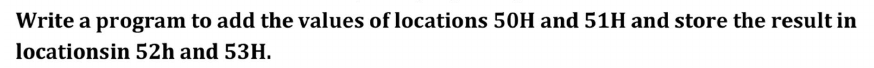

```
    MOV DPTR, #0050H    ; DPTR = 50H
    
    MOVX A, @DPTR       ; A = MEMORY[dptr] (value in memory at adress dptr (50)) [get first value]
    MOV R0, A           ; R0 = A
    
    INC DPTR            ; DPTR = 51H
    MOVX A, @DPTR       ; get 2nd value
    ADD A, R0           ; A = A + R0

    INC DPTR            ; DPTR = 52H
    MOVX @DPTR, A       ; MEMORY[DPTR] = A

    INC DPTR
    MOV A, #00H         ; A = 0
    ADDC A, #00H        ; A = A + C
    MOVX @DPTR, A       ; MEMORY[DPTR] = A [store carry]
    
WAIT:
    LJMP WAIT
```

9. 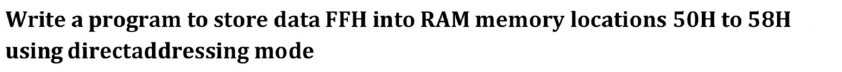

```
    MOV DPTR, #0050H    ; DPTR = 50H
    MOV A, #FFH         ; A = FFH
    MOV R0, #08         ; R0 = 08H

LOOP:
    MOVX @DPTR, A       ; MEM[DPTR] = A
    INC DPTR
    DJNZ R0, LOOP       ; R0 = R0 - 1 and jump if R0 != 0

WAIT:
    LJMP WAIT
```

1.  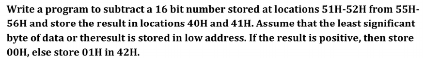

```
    MOV DPTR, #0051H    ; DPTR = 51H
    MOVX A, @DPTR       ; Load LSB of B
    MOV R0, A           ;
    MOV DPTR, #0055H    ; DPTR = 55H
    MOVX A, @DPTR       ; Load LSB of A

    CLR C               ; Clear carry before subtraction
    SUBB A, R0          ; Subtract LSB

    MOV DPTR, #0040H
    MOVX @DPTR, A       ; Store result LSB in 40H

    ; --- Subtract MSB with borrow ---
    MOV DPTR, #0052H    ; DPTR = 52H
    MOVX A, @DPTR       ; Load MSB of B
    MOV R0, A           ;
    MOV DPTR, #0056H    ; DPTR = 56H
    MOVX A, @DPTR       ; Load MSB of A

    SUBB A, R0          ; Subtract MSB

    MOV DPTR, #0041H    
    MOVX @DPTR, A       ; Store result MSB in 41H

    JNC POSITIVE        ; Jump if no carry (positive result)

    ; Negative case
    MOV DPTR, #0042H
    MOV @DPTR, #01H     ; Store 01H if result is negative
    LJMP WAIT

POSITIVE:
    MOV DPTR, #0042H
    MOV @DPTR, #00H     ; Store 00H if result is positive

WAIT:
    LJMP WAIT     ; Infinite loop

    
```

11. 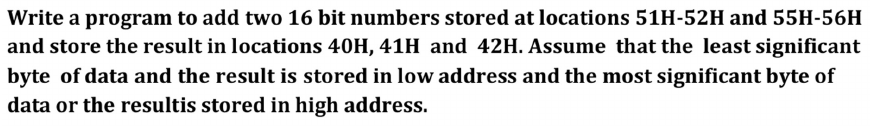

```
    MOV DPTR, #0051H    ; DPTR = 51H
    MOVX A, @DPTR       ; Load LSB of B
    MOV R0, A           ;
    MOV DPTR, #0055H    ; DPTR = 55H
    MOVX A, @DPTR       ; Load LSB of A

    CLR C               ; Clear carry before subtraction
    SUBB A, R0          ; Subtract LSB

    MOV DPTR, #0040H
    MOVX @DPTR, A       ; Store result LSB in 40H

    ; --- Subtract MSB with borrow ---
    MOV DPTR, #0052H    ; DPTR = 52H
    MOVX A, @DPTR       ; Load MSB of B
    MOV R0, A           ;
    MOV DPTR, #0056H    ; DPTR = 56H
    MOVX A, @DPTR       ; Load MSB of A

    SUBB A, R0          ; Subtract MSB

    MOV DPTR, #0041H    
    MOVX @DPTR, A       ; Store result MSB in 41H
    
    MOV DPTR, #0041H    ; to store borrow
    MOV A, #00H         ; A = 0
    ADDC A, #00H        ; A = A + 0 + Carry ( in this case Carry = Borrow for Subtraction )
    MOVX @DPTR, A       ; Store Borrow
    
    WAIT: LJMP WAIT   ; Infinite loop
```

12. 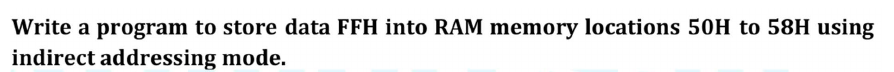

```
    MOV A, #0FFH        ; Load FFH into accumulator
    MOV DPTR, #0050H    ; Set external address to 50H

LOOP:
    MOVX @DPTR, A   ; Write FFH to external memory
    INC DPTR        ; Increment address

    MOV A, DPL
    CJNE A, #59H, LOOP ; Repeat until address 58H is reached; jumps if A != 59H 

WAIT: LJMP WAIT

```

13. 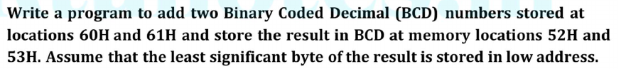

```
    ; --- Load first BCD LSB from external memory 60H ---
    MOV DPTR, #0060H
    MOVX A, @DPTR        ; A = [60H]
    MOV R0, A           ; R0 = A

    ; --- Load second BCD LSB from external memory 61H ---
    MOV DPTR, #0061H
    MOVX A, @DPTR       ; A = [61H] temporarily store in R0

    ; --- Add the BCD LSBs ---
    ADD A, R0            ; A = A + R0
    DA A                 ; Adjust to BCD

    ; --- Store result LSB to 52H ---
    MOV DPTR, #0052H
    MOVX @DPTR, A

    ; --- Add MSBs (carry only) ---
    MOV A, #00H          ; Clear A
    ADDC A, #00H         ; Add carry from LSB addition
    DA A                 ; Adjust to BCD

    ; --- Store result MSB to 53H ---
    MOV DPTR, #0053H
    MOVX @DPTR, A

WAIT:
    LJMP WAIT

```

14.  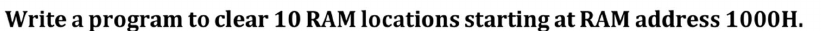

```
    MOV DPTR, #1000H    ; DPTR = 50H
    MOV A, #00H         ; A = 00H
    MOV R0, #0A         ; R0 = 0AH

LOOP:
    MOVX @DPTR, A       ; MEM[DPTR] = A
    INC DPTR
    DJNZ R0, LOOP       ; R0 = R0 - 1 and jump if R0 != 0

WAIT:
    LJMP WAIT
```

15. 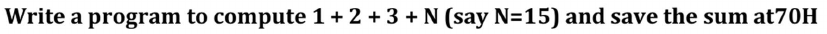

```
    MOV DPTR, #8100     ; memory location of N = #8100H
    MOVX A, @DPTR         ; A = N
    ADD A, #01            ; A = A + 1
    ADD A, #02            ; A = A + 2
    ADD A, #03            ; A = A + 3

    MOV DPTR, #0070     ; store result at 0070H
    MOVX @DPTR, A
```

16. 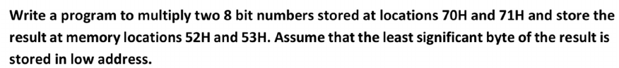

```
    MOV DPTR, #0070H
    MOVX A, @DPTR       ; A = [70H]
    MOV A, B              ; B = A

    ; --- Load second number from 71H ---
    MOV DPTR, #0071H
    MOVX A, @DPTR      ; Store second number in A

    ; --- Multiply A * B ---
    MUL AB              ; A * B --> result in A (LSB) and B (MSB)

    ; --- Store LSB result at 52H ---
    MOV DPTR, #0052H
    MOVX @DPTR, A

    ; --- Store MSB result at 53H ---
    MOV DPTR, #0053H
    MOV A, B
    MOVX @DPTR, A

WAIT:
    LJMP WAIT
```

17. 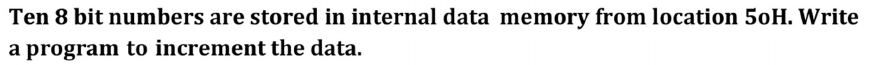

```
    MOV DPTR, #0050H    ; DPTR = 50H
    MOV R0, #0A         ; R0 = 0AH

LOOP:
    MOVX A, @DPTR       ; A = MEM[DPTR]
    INC A
    MOVX @DPTR, A       ; MEM[DPTR] = A
    INC DPTR
    DJNZ R0, LOOP       ; R0 = R0 - 1 and jump if R0 != 0

WAIT:
    LJMP WAIT
```

18. 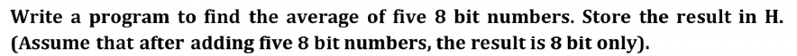

```
    MOV DPTR, #0060H     ; Start address of numbers
    CLR A                ; Clear accumulator (sum = 0)
    MOV R0, #05H         ; Counter for 5 numbers

SUM_LOOP:
    MOV R2, A           ; R2 = A
    MOVX A, @DPTR       ; Load number into A
    MOV R1, A           ; R1 = A
    MOV A, R2           ; A = R2 [restore early value at A]

    ADD A, R1            ; Add R1 to accumulator
    INC DPTR             ; Next address
    DJNZ R0, SUM_LOOP    ; Repeat 5 times

    ; --- Divide sum by 5 ---
    MOV B, #05H
    DIV AB               ; A = A / 5, remainder in B

    <!-- ; --- Store result in "H" (let's assume R7 = H) --- -->
    INC DPTR
    MOVX @DPTR, A       ; store result in next DPTR address

    ; --- End ---
WAIT:
    LJMP WAIT

```

19. 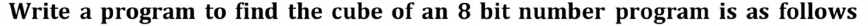

```
    MOV DPTR, #0060H
    MOVX A, @DPTR       ; A = number to cube
    MOV B, A
    MUL AB              ; A * B = A (LSB), B (MSB) --> A = num^2 LSB, B = num^2 MSB

    ; --- Save num^2 temporarily ---
    MOV R0, A           ; Store num^2 LSB in R0
    MOV R1, B           ; Store num^2 MSB in R1

    ; --- Multiply num^2 * num = cube ---
    MOV DPTR, #0060H
    MOVX A, @DPTR       ; Load original number again
    MOV B, R0           ; Multiply with LSB first
    MUL AB              ; A * B = A (cube LSB), B = middle byte
    MOV R2, A           ; Save cube LSB in R2
    MOV R3, B           ; Save middle byte in R3

    MOV A, R1           ; num^2 MSB
    MOV B, A
    MOV DPTR, #0060H
    MOVX A, @DPTR       ; Load original number again
    MUL AB              ; A * B = A = upper byte contribution
    ADD A, R3           ; Add middle byte from previous MUL
    MOV R4, A           ; Save MSB of cube in R4

    ; --- Store results ---
    MOV DPTR, #0052H
    MOV A, R2
    MOVX @DPTR, A       ; Store LSB at 52H

    INC DPTR
    MOV A, R4
    MOVX @DPTR, A       ; Store MSB at 53H

    ; --- End ---
WAIT:
    LJMP WAIT

```

20. 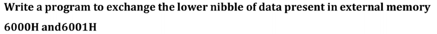

nibble  = 4 bits
byte    = 8 bits

lower nibble = lower 4 bits of data

```
    ; --- Load data from 6000H ---
    MOV DPTR, #6000H
    MOVX A, @DPTR       ; Load data from 6000H into A
    MOV R0, A           ; Store A in R0 (data1)

    ; --- Load data from 6001H ---
    MOV DPTR, #6001H
    MOVX A, @DPTR       ; Load data from 6001H into A
    MOV R1, A           ; Store A in R1 (data2)

    ; --- Exchange lower nibbles ---
    MOV A, R0
    ANL A, #0F0H        ; Keep upper nibble of data1
    MOV R2, A           ; Store in R2

    MOV A, R1
    ANL A, #0FH         ; Get lower nibble of data2
    ORL A, R2           ; Combine with upper nibble of data1
    MOV R3, A           ; Store exchanged data1

    MOV A, R1
    ANL A, #0F0H        ; Keep upper nibble of data2
    MOV R2, A

    MOV A, R0
    ANL A, #0FH         ; Get lower nibble of data1
    ORL A, R2           ; Combine with upper nibble of data2
    MOV R4, A           ; Store exchanged data2

    ; --- Store exchanged values back ---
    MOV DPTR, #6000H
    MOV A, R3
    MOVX @DPTR, A       ; Store back to 6000H

    MOV DPTR, #6001H
    MOV A, R4
    MOVX @DPTR, A       ; Store back to 6001H

    ; --- End ---
WAIT:
    LJMP WAIT

```

34. 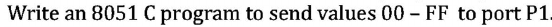

```C
    #include <reg51.h>  // Header file for 8051 registers

    void main() {
        unsigned char i;
        
        while (1) {
            for (i = 0x00; i <= 0xFF; i++) {
                P1 = i; // Send value to Port 1
            }
        }
    }
```

35. 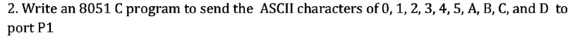

```C
#include <reg51.h>  // 8051 special function register definitions

void main() {
    unsigned char ascii_values[] = {'0', '1', '2', '3', '4', '5', 'A', 'B', 'C', 'D'};
    unsigned char i;

    while (1) {
        for (i = 0; i < 10; i++) {
            P1 = ascii_values[i];  // Send ASCII value to Port 1
        }
    }
}
```

37. 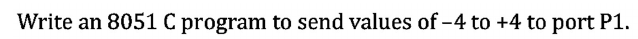

```C
#include <reg51.h>  // Header file for 8051 microcontroller

void main() {
    signed char i;  // signed variable to handle negative numbers

    while (1) {
        for (i = -4; i <= 4; i++) {
            P1 = i;  // Send signed value to Port 1
        }
    }
}
```

40. 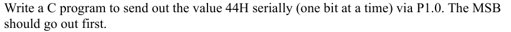

```C
#include <reg51.h>  // Header for AT89S52 (compatible with reg51)

sbit TX_PIN = P1^0;  // Define P1.0 as TX_PIN

void delay() {
    unsigned int i;
    for (i = 0; i < 500; i++);  // Simple delay for timing
}

void main() {
    unsigned char data = 0x44;  // 44H = 01000100b
    unsigned char mask = 0x80;  // Start with MSB (10000000b)

    while (mask != 0) {
        TX_PIN = (data & mask) ? 1 : 0;  // Send bit via TX_PIN
        delay();                         // Add delay for bit spacing
        mask >>= 1;                      // Shift to next bit
    }

    while (1);  // Infinite loop to stop further execution
}

```

41. 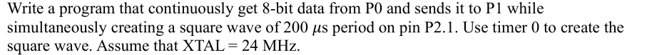

- XTAL = 24 MHz → Machine cycle = 1 / (24MHz / 12) = 0.5 µs.
- To get 100 µs, you need 200 counts (100 µs / 0.5 µs).
- 65536 - 200 = 65336 = 0xFF9C, so we load TH0 = 0xFF, TL0 = 0x9C.
- Timer 0 toggles P2.1 every 100 µs, creating a square wave with a 200 µs period (5 kHz).

```C
#include <reg52.h>  // For AT89S52

sbit square_wave = P2^1;  // Define P2.1 for square wave output

void timer0_ISR(void) interrupt 1 {  // Timer 0 interrupt vector
    square_wave = ~square_wave;  // Toggle P2.1
    // Reload Timer0 for 100us interrupt (for 200us full period)
    TH0 = 0xFF;  // Reload high byte (calculated for 100us delay)
    TL0 = 0x9C;  // Reload low byte
}

void main() {
    // Timer 0 setup for 100us delay with XTAL = 24MHz
    TMOD = 0x01;   // Timer 0 Mode 1 (16-bit timer)
    TH0 = 0xFF;    // Initial value for 100us
    TL0 = 0x9C;
    ET0 = 1;       // Enable Timer 0 interrupt
    EA = 1;        // Enable global interrupts
    TR0 = 1;       // Start Timer 0

    while (1) {
        P1 = P0;  // Continuously transfer 8-bit data from P0 to P1
    }
}

```

42. 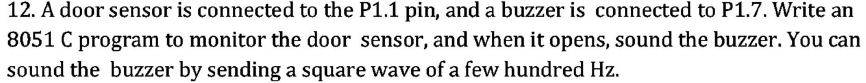

```C
    #include <reg51.h>

    // Define pins
    sbit DOOR_SENSOR = P1^1;  // P1.1
    sbit BUZZER = P1^7;       // P1.7

    void delay_ms(unsigned int ms) {
        unsigned int i, j;
        for(i = 0; i < ms; i++) {
            for(j = 0; j < 127; j++);  // Roughly 1 ms delay on 11.0592 MHz
        }
    }

    void main(void) {
        while(1) {
            if(DOOR_SENSOR == 1) { // Door opened (assuming active high)
                // Generate square wave for buzzer
                BUZZER = 1;
                delay_ms(1); // Adjust this for desired frequency (e.g., ~500Hz)
                BUZZER = 0;
                delay_ms(1);
            } else {
                BUZZER = 0; // Door closed, buzzer off
            }
        }
    }

```

43. 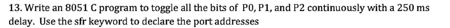
- The **sfr** keyword stands for **Special Function Register**. It is used in embedded C (especially with 8051 microcontrollers) to declare and access specific **memory-mapped registers** that control the microcontroller’s peripherals like ports, timers, serial communication, etc.
```C
#include <reg51.h>

// Using sfr keyword to declare ports
sfr P0 = 0x80;
sfr P1 = 0x90;
sfr P2 = 0xA0;

void delay_250ms() {
    unsigned int i, j;
    for (i = 0; i < 250; i++) {
        for (j = 0; j < 120; j++) {
            // Approximate 1ms delay (for 12MHz crystal)
        }
    }
}

void main() {
    while (1) {
        P0 = ~P0;  // Toggle all bits of P0
        P1 = ~P1;  // Toggle all bits of P1
        P2 = ~P2;  // Toggle all bits of P2
        delay_250ms();  // 250 ms delay
    }
}

```

44. 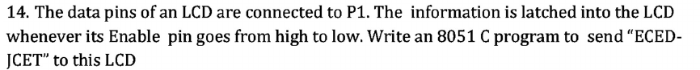

```C
#include <reg51.h>

sfr P1 = 0x90; // Port 1
sbit EN = P2^0; // Enable pin on P2.0

void delay(unsigned int ms) {
    unsigned int i, j;
    for(i = 0; i < ms; i++)
        for(j = 0; j < 1275; j++); // Roughly 1 ms delay for 12MHz clock
}

void lcd_send(char ch) {
    P1 = ch;   // Put character on data lines
    EN = 1;    // Enable high
    delay(1);  // Small delay
    EN = 0;    // Enable low (data latched)
    delay(1);
}

void main() {
    char str[] = "ECED-JCET";
    unsigned char i;
    
    while(1) {
        for(i = 0; str[i] != '\0'; i++) {
            lcd_send(str[i]);
        }
        while(1); // Stop after sending the string once
    }
}

```

45. 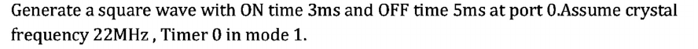
```C
#include <reg51.h>

sbit output_pin = P0^0;  // Square wave output on P0.0

void delay_ms(unsigned int ms) {
    unsigned int i;
    for (i = 0; i < ms; i++) {
        TMOD = 0x01; // Timer 0 Mode 1 (16-bit timer)
        // For 22MHz, machine cycle = 12/22MHz = ~0.545us
        // So, 1ms ≈ 1835 counts => 65536 - 1835 = 63701 = 0xF8ED
        TH0 = 0xF8; 
        TL0 = 0xED;

        TR0 = 1;          // Start Timer 0
        while (TF0 == 0); // Wait for overflow
        TR0 = 0;          // Stop Timer 0
        TF0 = 0;          // Clear overflow flag
    }
}

void main() {
    while (1) {
        output_pin = 1;   // ON state
        delay_ms(3);      // 3ms delay
        output_pin = 0;   // OFF state
        delay_ms(5);      // 5ms delay
    }
}
```
# Basic Timer Working
-   **TMOD** = 1 (mode select always set 1 for our case)
-   **TH0** and **TL0** is the delay required, ie the value the timer must count to
-   **TR0** - ready signal. (when TR0 = 1, timer starts. else it stops)
-   **TF0** - the signal is 0 if timer has completed counting else it is 1

- Timer Working to determine TH0 and TL0 values: 
- 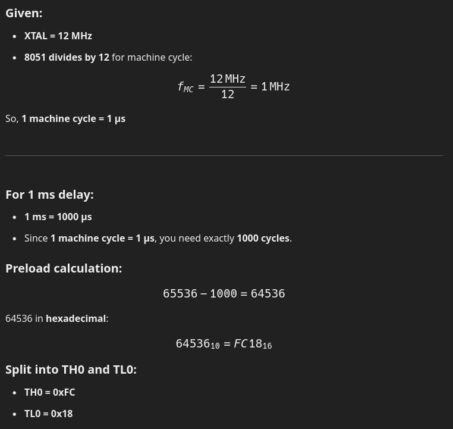
